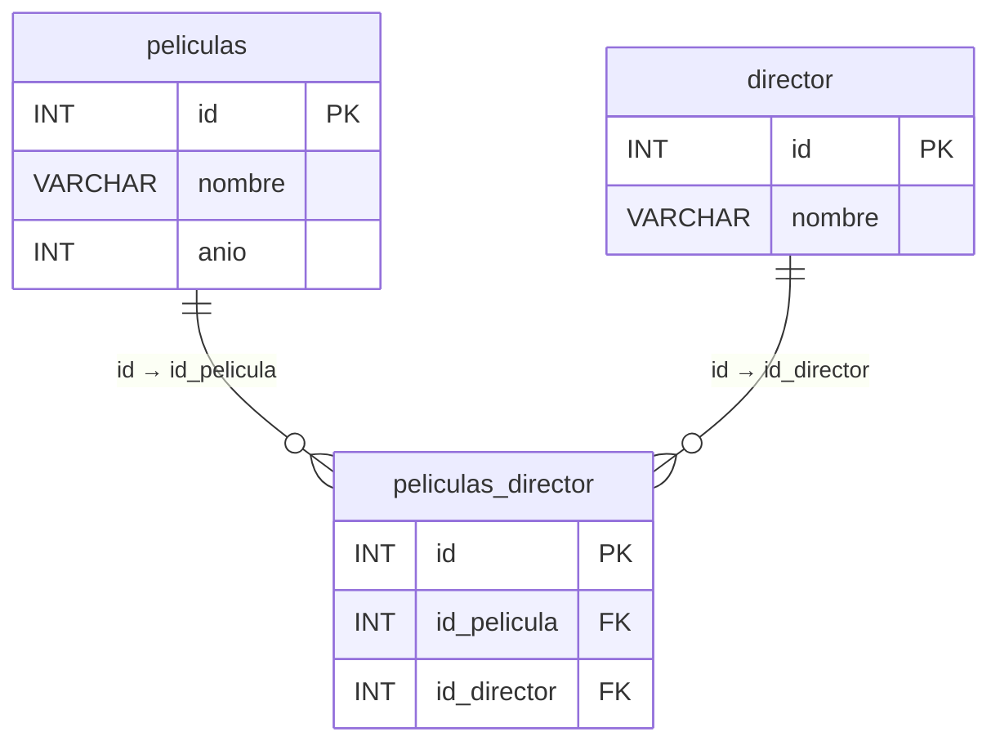

# Bases de datos relacionales

Vamos a crear una base de datos con 2-3 tablas de datos relacionadas entre sí.

---

## DB Películas

### Estructura de tablas

**Tablas de datos**

| Tabla       | Campos                  |
|-------------|-------------------------|
| `peliculas` | `id`, `nombre`, `anio`  |
| `director`  | `id`, `nombre`          |

**Tabla de relación**

| Tabla                | Campos                              |
|----------------------|-------------------------------------|
| `peliculas_director` | `id`, `id_pelicula`, `id_director`  |

---

### Datos de ejemplo

| id | Título                                          | Año  | Director          |
|----|-------------------------------------------------|------|-------------------|
| 1  | La lista de Schindler                           | 1993 | Steven Spielberg  |
| 2  | Volver a empezar                                | 1982 | José Luis Garci   |
| 3  | Holocausto caníbal                              | 1980 | Ruggero Deodato   |
| 4  | Jurassic Park                                   | 1994 | Steven Spielberg  |
| 5  | El abuelo                                       | 1998 | José Luis Garci   |
| 6  | Indiana Jones: En busca del arca perdida        | 1981 | Steven Spielberg  |
| 7  | La guerra de las galaxias: Una nueva esperanza  | 1977 | George Lucas      |

---

## Desarrollo técnico

### 01. Crear nueva base de datos

En AdminerNeo (o el sistema que estemos usando), crear una nueva base de datos vacía.

```sql
CREATE DATABASE db_peliculas;
```

---

### 02. Crear las tablas

#### Tabla `peliculas`

```sql
CREATE TABLE `peliculas` (
  `id`     INT          NOT NULL AUTO_INCREMENT PRIMARY KEY,
  `nombre` VARCHAR(255) NOT NULL,
  `anio`   INT(4)       NOT NULL
);
```

#### Tabla `director`

```sql
CREATE TABLE `director` (
  `id`     INT          NOT NULL AUTO_INCREMENT PRIMARY KEY,
  `nombre` VARCHAR(255) NOT NULL
);
```

#### Tabla de relación `peliculas_director`

La tabla de relación contiene dos **claves foráneas**: `id_pelicula` apunta al `id`
de la tabla `peliculas`, e `id_director` apunta al `id` de la tabla `director`.
Esto es lo que establece la relación entre ambas entidades.

```sql
CREATE TABLE `peliculas_director` (
  `id`          INT NOT NULL AUTO_INCREMENT PRIMARY KEY,
  `id_pelicula` INT NOT NULL,
  `id_director` INT NOT NULL,
  FOREIGN KEY (`id_pelicula`) REFERENCES `peliculas`(`id`),
  FOREIGN KEY (`id_director`) REFERENCES `director`(`id`)
);
```

---

### 03. Insertar datos

#### Películas

```sql
INSERT INTO `peliculas` (`nombre`, `anio`) VALUES
  ('La lista de Schindler',                          1993),
  ('Volver a empezar',                               1982),
  ('Holocausto caníbal',                             1980),
  ('Jurassic Park',                                  1994),
  ('El abuelo',                                      1998),
  ('Indiana Jones: En busca del arca perdida',       1981),
  ('La guerra de las galaxias: Una nueva esperanza', 1977);
```

#### Directores

```sql
INSERT INTO `director` (`nombre`) VALUES
  ('Steven Spielberg'),
  ('José Luis Garci'),
  ('Ruggero Deodato'),
  ('George Lucas'),
  ('Christopher Nolan');
```

> **Nota:** Se incluye Christopher Nolan sin películas asignadas, útil para
> practicar consultas con `LEFT JOIN` y ver directores sin coincidencias.

#### Relaciones película–director

Los `id` corresponden al orden de inserción en cada tabla.

| id | id_pelicula | id_director | Relación                                        |
|----|-------------|-------------|-------------------------------------------------|
| 1  | 1           | 1           | La lista de Schindler → Steven Spielberg        |
| 2  | 2           | 2           | Volver a empezar → José Luis Garci              |
| 3  | 3           | 3           | Holocausto caníbal → Ruggero Deodato            |
| 4  | 4           | 1           | Jurassic Park → Steven Spielberg                |
| 5  | 5           | 2           | El abuelo → José Luis Garci                     |
| 6  | 6           | 1           | Indiana Jones → Steven Spielberg                |
| 7  | 7           | 4           | La guerra de las galaxias → George Lucas        |

```sql
INSERT INTO `peliculas_director` (`id_pelicula`, `id_director`) VALUES
  (1, 1),
  (2, 2),
  (3, 3),
  (4, 1),
  (5, 2),
  (6, 1),
  (7, 4);
```

---

### 04. Revisar los datos insertados

```sql
SELECT * FROM peliculas;
SELECT * FROM director;
SELECT * FROM peliculas_director;
```

---

### 05. Consultar los datos con JOIN

Un `JOIN` cruza dos tablas usando una condición `ON` que vincula sus claves.
Para unir tres tablas encadenamos dos `JOIN` seguidos.

#### Consulta básica (todos los campos)

Versión sin abreviaturas
```sql
SELECT *
FROM peliculas_director
  JOIN peliculas ON peliculas_director.id_pelicula = peliculas.id
  JOIN director  ON peliculas_director.id_director = director.id;
```

Con uso de abreviaturas (igual que la anterior pero con abreviaturas)
```sql
SELECT *
FROM peliculas_director pd
  JOIN peliculas p ON pd.id_pelicula = p.id
  JOIN director  d ON pd.id_director = d.id;
```

#### Consulta específica (solo los campos útiles)

```sql
SELECT
  p.nombre AS pelicula,
  p.anio   AS año,
  d.nombre AS director
FROM peliculas_director pd
  JOIN peliculas p ON pd.id_pelicula = p.id
  JOIN director  d ON pd.id_director = d.id
ORDER BY p.anio;
```

Resultado esperado:

| pelicula                                        | año  | director          |
|-------------------------------------------------|------|-------------------|
| La guerra de las galaxias: Una nueva esperanza  | 1977 | George Lucas      |
| Holocausto caníbal                              | 1980 | Ruggero Deodato   |
| Indiana Jones: En busca del arca perdida        | 1981 | Steven Spielberg  |
| Volver a empezar                                | 1982 | José Luis Garci   |
| La lista de Schindler                           | 1993 | Steven Spielberg  |
| Jurassic Park                                   | 1994 | Steven Spielberg  |
| El abuelo                                       | 1998 | José Luis Garci   |

---

### Utilidades

| Acción                            | Comando SQL                          |
|-----------------------------------|--------------------------------------|
| Borrar los datos (conserva tabla) | `TRUNCATE TABLE nombre_tabla;`       |
| Eliminar la tabla completa        | `DROP TABLE nombre_tabla;`           |
| Eliminar la base de datos entera  | `DROP DATABASE nombre_base_datos;`   |
| Crear una nueva base de datos     | `CREATE DATABASE nombre_base_datos;` |

> **Importante:** `TRUNCATE` no funciona en tablas con claves foráneas activas.
> En ese caso usa `DELETE FROM nombre_tabla;` en su lugar.

---

## Todo de golpe:

```sql
# Crear base de datos:
CREATE DATABASE db_peliculas;


# Crear Tabla Peliculas
CREATE TABLE `peliculas` (
  `id`     INT          NOT NULL AUTO_INCREMENT PRIMARY KEY,
  `nombre` VARCHAR(255) NOT NULL,
  `anio`   INT(4)       NOT NULL
);

# Creat Tabla Director
CREATE TABLE `director` (
  `id`     INT          NOT NULL AUTO_INCREMENT PRIMARY KEY,
  `nombre` VARCHAR(255) NOT NULL
);

# Crear Tabla de Relación:
CREATE TABLE `peliculas_director` (
  `id`          INT NOT NULL AUTO_INCREMENT PRIMARY KEY,
  `id_pelicula` INT NOT NULL,
  `id_director` INT NOT NULL,
  FOREIGN KEY (`id_pelicula`) REFERENCES `peliculas`(`id`),
  FOREIGN KEY (`id_director`) REFERENCES `director`(`id`)
);


# Insertar datos:
INSERT INTO `peliculas` (`nombre`, `anio`) VALUES
  ('La lista de Schindler',                          1993),
  ('Volver a empezar',                               1982),
  ('Holocausto caníbal',                             1980),
  ('Jurassic Park',                                  1994),
  ('El abuelo',                                      1998),
  ('Indiana Jones: En busca del arca perdida',       1981),
  ('La guerra de las galaxias: Una nueva esperanza', 1977);

INSERT INTO `director` (`nombre`) VALUES
  ('Steven Spielberg'),
  ('José Luis Garci'),
  ('Ruggero Deodato'),
  ('George Lucas'),
  ('Christopher Nolan');

INSERT INTO `peliculas_director` (`id_pelicula`, `id_director`) VALUES
  (1, 1),
  (2, 2),
  (3, 3),
  (4, 1),
  (5, 2),
  (6, 1),
  (7, 4);


```

## Consulta

```sql
SELECT *
FROM peliculas_director
  JOIN peliculas ON peliculas_director.id_pelicula = peliculas.id
  JOIN director  ON peliculas_director.id_director = director.id;
  ```

---





---
### Ejercicio

A. Repetir lo anterior
  1. Replica lo hecho anteriormetne
  2. Añade datos de forma manual a la base de datos (más pelis, más directores, más relaciones)
  3. Revisa que los datos se ven y relacionan correctamente 

B. Creación de tu propia base de datos relacionada (simple)
 1. Hacemos un esquema en el Figma Compartido (añade tu nombre arriba del todo)
 2. Creamos el código y vamos registrando los pasos en un .md por si metemos la pata y tenemos que volver atrás que tengamos maneras de reutilizar código o revisar pasos.
 3. Testeamos en AdminerNeo y avisamos al profe para enseñarselo con orgullo.

 C. Diseña tu propia base de datos (compleja)
  1. Ahora flípate y crea un esquema (en Figma o draw_db) de una posible base de datos mucho más compleja (sólo disélala de forma visual, no hace falta que la construyas).