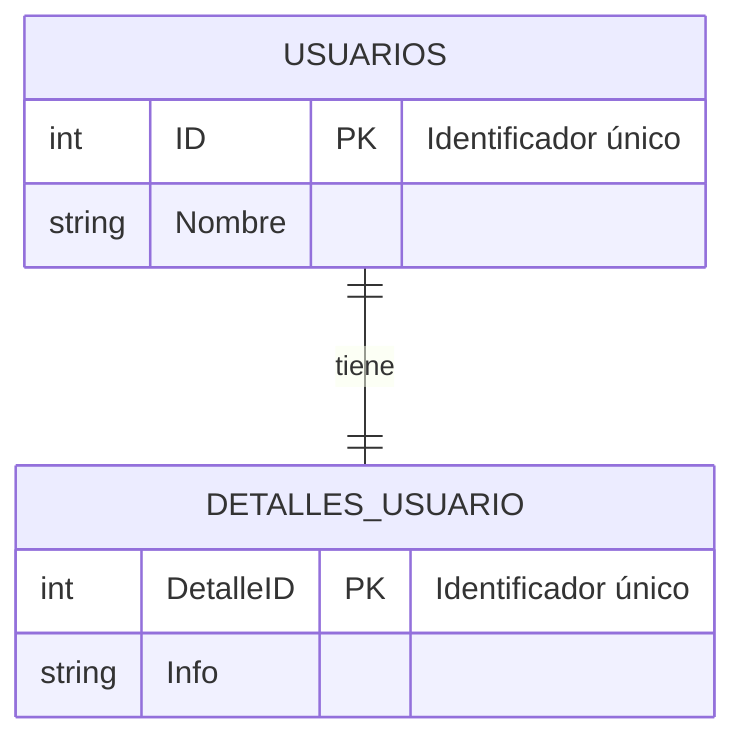

# 💍 Relaciones entre Tablas de Bases de Datos

Este documento cubre conceptos fundamentales en el diseño de bases de datos, tales como **🔑 claves primarias**, **🗝️ claves foráneas** y **✏️ normalización**, además de describir los distintos tipos de relaciones entre tablas. A continuación, se presenta un resumen con ejemplos y esquemas para facilitar el aprendizaje.

---

## **1. Claves Primarias (Primary Key)**
Una **clave primaria** es un campo o conjunto de campos en una tabla que **identifica de forma única cada fila** de esa tabla. Algunas características importantes son:
- **Única**: No puede haber dos registros con el mismo valor.
- **No nula**: No debe estar vacío; cada registro debe tener un valor en la clave primaria.
- **Ejemplos en el mundo real**: Matrícula, DNI o ID.

Ejemplo: Si tienes una tabla de Usuarios, la clave primaria podría ser el ID de usuario, ya que cada usuario tiene un ID único.

Clave Primaria = Primary Key = PK

### **Ejemplo: Tabla de Usuarios**
| **ID🔑(PK)** | **Nombre** | **Edad** |
|-------------|------------|----------|
| 1           | Ana        | 30       |
| 2           | Luis       | 25       |
| 3           | Marta      | 40       |

*En este ejemplo, la columna **ID** es la clave primaria, ya que identifica de forma única a cada usuario.*

---

## **2. Claves Foráneas (Foreign Key)**
Una **clave foránea** es un campo en una tabla que se refiere a una **clave primaria** en otra tabla.
Esto **establece una relación** entre ambas tablas y asegura la integridad de los datos.
Un ejemplo en el mundo real podría ser: el DNI:99 444 333 tiene es conductor del coche MATRÍCULA: 234555BR
(Es decir, en ambos casos estamos dando referencias únicas)

La clave foránea asegura que los datos entre las tablas estén relacionados de manera consistente.

_**Ejemplo:** Si tienes una tabla de Pedidos que guarda información de los pedidos realizados por los usuarios, la tabla de Pedidos  tendrá una columna con el ID de usuario que hace el pedido. Ese campo es una clave foránea, ya que hace referencia al ID de usuario de la tabla de Usuarios._

### **Ejemplo: Tabla de Pedidos**
| **PedidoID** | **Fecha**   | **UsuarioID (FK)** |
|--------------|-------------|--------------------|
| 101          | 2025-03-01  | 1                  |
| 102          | 2025-03-02  | 2                  |

*Aquí, **UsuarioID** es una clave foránea que se refiere a la clave primaria **ID** en la tabla de Usuarios.*

---

## **3. Normalización**
La **normalización** es el proceso de organizar las tablas de una base de datos para **reducir la duplicación de datos** y evitar inconsistencias. El objetivo es dividir la información en tablas relacionadas que permitan:
- **Eficiencia** en el almacenamiento.
- **Coherencia** en la actualización de datos.

### **Ejemplo:**
Si se tiene una tabla de Pedidos que repite información del usuario:
| **PedidoID** | **Fecha**   | **UsuarioID** | **Nombre Usuario** | **Dirección Usuario** |
|--------------|-------------|---------------|--------------------|-----------------------|
| 101          | 2025-03-01  | 1             | Ana                | Calle 123             |
| 102          | 2025-03-02  | 2             | Luis               | Calle 456             |

La normalización sugiere **dividir** esta información en dos tablas:
- **Usuarios**: Contiene la información única del usuario.
- **Pedidos**: Contiene la información del pedido y una referencia al usuario.

---

## **4. Tipos de Relaciones entre Tablas**

### **4.1 Relación 1 a 1 (One to One)**
Cada registro en la primera tabla está relacionado con **exactamente un registro** en la segunda tabla y viceversa.  
**Ejemplo: Usuarios y Detalles de Usuario**

| **Usuarios** |          | **Detalles de Usuario** |
|--------------|----------|-------------------------|
| **ID (PK)**  | Nombre   | **DetalleID (PK)**      |
| 1            | Ana      | 1                       |
| 2            | Luis     | 2                       |

> **Nota:** La columna en la tabla *Detalles de Usuario* actúa como clave foránea referenciando la clave primaria de *Usuarios*.

#### **Mermaid Diagram – Relación 1 a 1**

## 3. Normalización
La normalización es el proceso de organizar las tablas en una base de datos para reducir la duplicación de datos y evitar problemas de inconsistencia. El objetivo es dividir la información en varias tablas relacionadas de forma que se pueda almacenar de manera más eficiente y coherente.

Por ejemplo, si tienes una tabla de Pedidos con la siguiente información:

| PedidoID	| Fecha	| UsuarioID	|Nombre Usuario|Dirección Usuario|
|-----------|-------|----------|----------------|---------------:|
|101	|2025-03-01 |	1	|Ana | Calle 123 |
|102	|2025-03-02	| 2	| Luis | Calle 456 |

Puedes ver que los datos del Usuario se repiten, lo que no es eficiente. La normalización sugiere dividir esos datos en dos tablas:

Usuarios (contiene la información del usuario)
Pedidos (contiene la información del pedido, con una referencia al usuario)

| Usuarios | ID |
|--|--|
| 1| 2|

|Pedidos|PedidoID|
|-|-|
|101|102|

De esta manera, evitamos la redundancia y logramos que si un usuario cambia su dirección, solo tengamos que hacerlo una vez en la tabla de Usuarios.

En resumen:

Clave primaria: Identifica de manera única cada registro en una tabla.
Clave foránea: Enlaza dos tablas relacionadas.
Normalización: Organiza los datos en varias tablas para evitar duplicación y mejorar la consistencia.
¿Te gustaría que profundice en alguno de estos temas o te explique otro concepto relacionado?

Tú dijiste:
Me gustaría que me explicases los conceptos relacionados con 1 es a 1, 1 es a muchos, 1 es a n, etc, etc, etc.
ChatGPT Plus
Claro, esos conceptos están relacionados con las relaciones entre tablas en una base de datos. Cuando hablamos de relaciones, nos referimos a cómo las tablas se vinculan entre sí a través de claves primarias y foráneas. Aquí te explico los principales tipos de relaciones:

## 1. Relación 1 a 1 (One to One)
Una relación 1 a 1 significa que un registro de una tabla está relacionado con exactamente un registro de otra tabla. Es decir, para cada fila en la primera tabla, hay una única fila en la segunda tabla, y viceversa.

Ejemplo: Supón que tienes una tabla de Usuarios y una tabla de Detalles de Usuario, donde cada usuario tiene solo un conjunto de detalles únicos.

|Usuarios| 						|Detalles de Usuario|
|-----------|-------------------|-------------------|
| ID (PK)	|Nombre	ID			|Detalle (PK)		|
| 1	     	|Ana                | 1					|
| 2      	|Luis 	            | 2					|

En este caso, UsuarioID en la tabla Detalles de Usuario es una clave foránea que se refiere a la clave primaria ID en la tabla Usuarios.
Cada usuario tiene solo un detalle asociado, y cada detalle pertenece a solo un usuario. Es una relación 1 a 1.

### 2. Relación 1 a Muchos (One to Many)
Una relación 1 a muchos significa que un registro de una tabla puede estar relacionado con muchos registros en otra tabla. Es una de las relaciones más comunes y es el caso cuando se tiene una tabla principal que puede tener múltiples registros asociados en una tabla secundaria.

Ejemplo: En una base de datos de Usuarios y Pedidos, un usuario puede tener muchos pedidos. Sin embargo, cada pedido pertenece a un solo usuario.

|Usuarios	| 			|Pedidos		|
|-----------|-----------|---------------|
|ID (PK)	|Nombre		| PedidoID (PK)	|
|1			|Ana		|101			|
|2			|Luis		|102			|
|2			|Luis		|103			|
|1			|Ana		|104			|
- En este caso, **UsuarioID** en la tabla **Pedidos** es una clave foránea que hace referencia a **ID** en la tabla **Usuarios**.
- Un **usuario** puede tener **varios pedidos**, pero cada **pedido** solo pertenece a un único usuario. Es una relación** 1 a muchos**.

### 3. Relación Muchos a 1 (Many to One)
La relación muchos a 1 es lo opuesto a la relación 1 a muchos. En esta relación, muchos registros de una tabla pueden estar relacionados con un solo registro de otra tabla. Aunque se expresa de manera diferente, es conceptualmente lo mismo que una relación 1 a muchos pero vista desde el otro lado.

Ejemplo: En el caso anterior, si consideramos los Pedidos y los Usuarios, estamos viendo que muchos pedidos pueden estar relacionados con un solo usuario. Es simplemente otra forma de verlo, pero sigue siendo una relación 1 a muchos.

### 4. Relación Muchos a Muchos (Many to Many)
Una relación muchos a muchos significa que muchos registros de una tabla pueden estar relacionados con muchos registros de otra tabla. Este tipo de relación se maneja usando una tabla intermedia que actúa como puente entre las dos tablas principales.

Ejemplo: Supón que tienes una base de datos con Estudiantes y Cursos. Un estudiante puede inscribirse en varios cursos, y un curso puede tener varios estudiantes. Para representar esta relación, crearíamos una tabla intermedia, algo así como Inscripciones.

|Estudiantes		| 			|Cursos		| 					|Inscripciones	    |
|-------------------|-----------|----------:|-------------------|-----------------: |
|ID (PK)			|Nombre		| ID (PK)	|Curso				|EstudianteID (FK)	|
|1					|Ana		|1			|Matemáticas		|1					|
|2					|Luis		|2			|Historia			|1					|
|1					|Ana		|3			|Física				|2					|
|3					|Marta		|2			|Historia			|3					|

- La tabla **Inscripciones** es una tabla intermedia que tiene claves foráneas de ambas tablas: **Estudiantes y Cursos**.
- Un **estudiante** puede estar inscrito en **varios cursos**, y un curso puede tener varios estudiantes. Esto representa una relación muchos a muchos.

### Resumen de Relaciones:
- **1 a 1**: Un registro de una tabla está relacionado con un único registro en otra tabla.
- **1 a muchos**: Un registro de una tabla está relacionado con muchos registros en otra tabla.
- **Muchos a 1**: Muchos registros de una tabla están relacionados con un único registro en otra tabla (es básicamente una vista opuesta de 1 a muchos).
- **Muchos a muchos**: Muchos registros de una tabla pueden estar relacionados con muchos registros en otra tabla, y se resuelve usando una tabla intermedia.
