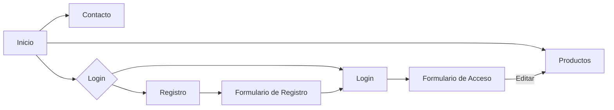

# Ejemplo Diagrama de flujo

```mermaid
graph LR

A[Inicio] --> B[Productos]
A --> C[Contacto]
A --> E{Login} --> F[Login] --> G[Formulario de Acceso]
E --> H[Registro] --> I[Formulario de Registro]
I -->F
G -- Editar --> B


```